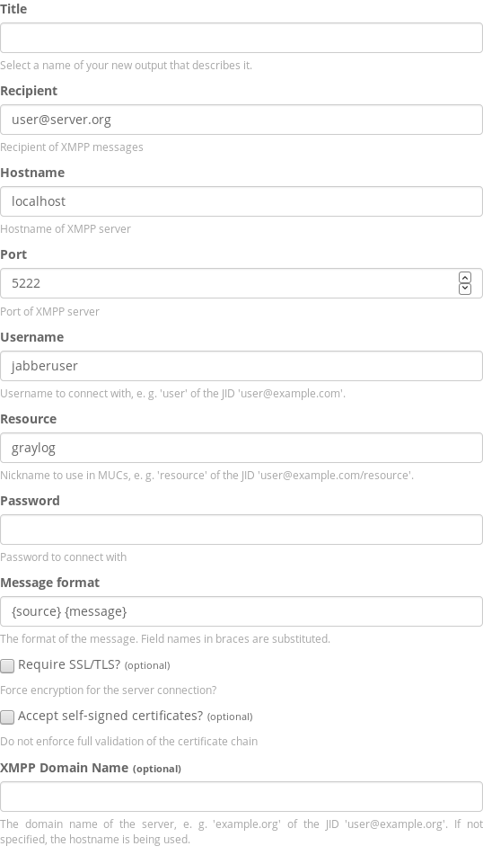

# XMPP output plugin for Graylog

Graylog plugin to output messages to an XMPP server.

Installation
------------
[Download the plugin](https://github.com/PLUTEX/graylog-plugin-output-xmpp/releases)
and place the `.jar` file in your Graylog plugin directory. The plugin directory
is the `plugins/` folder relative from your `graylog-server` directory by default
and can be configured in your `graylog.conf` file.

Restart `graylog-server` and you are done.

Configuration
-------------

Besides the standard XMPP connection parameters, you can configure a resource
prefix that must be unique to each instance of the plugin using the same XMPP
account. This enables you to have multiple instances of the plugin (e.g. with
differing message formats) in the same cluster. This prefix is joined with the
anonymized Graylog node ID, so that multiple nodes in the cluster can establish
XMPP connections simultaneously.
